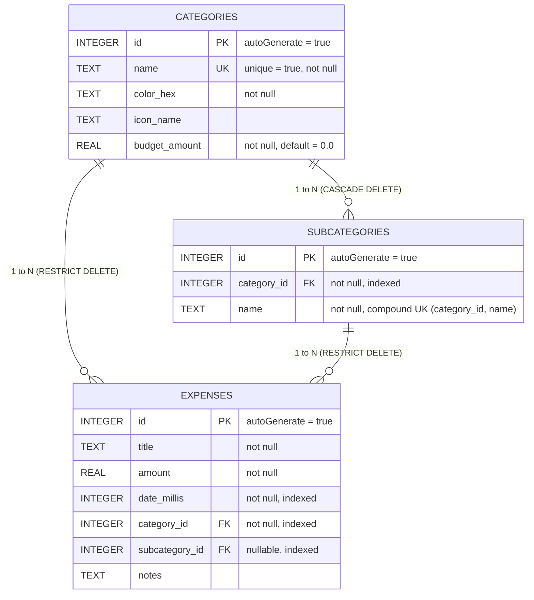

# Technical Documentation: Monthly Expense Tracker (Android)

## 1. Executive Summary
The **Monthly Expense Tracker** is a native Android application developed in Java to provide personal financial management focused on monthly budgeting and expense tracking. The application is completely **offline-first**, storing all data locally via Android Jetpack Room (backed by SQLite). It features predefined and customizable hierarchical categories/subcategories, an interactive Canvas-based analytics dashboard, search/filter capabilities, and multi-currency support.

---

## 2. System Architecture & High-Level Design

The project adopts the **Model-View-ViewModel (MVVM)** architectural pattern combined with the **Repository Pattern** to enforce separation of concerns, testability, and reactive state updates.

### 2.1 Architectural Layers

```
+-------------------------------------------------------------+
|                        UI Layer                             |
|  (MainActivity, DashboardFragment, ExpensesListFragment,   |
|   SettingsFragment, DialogFragments, Custom Canvas Views)   |
+------------------------------+------------------------------+
                               | Observes LiveData / Events
                               v
+-------------------------------------------------------------+
|                     ViewModel Layer                         |
|   (DashboardViewModel, ExpenseViewModel, CategoryViewModel) |
+------------------------------+------------------------------+
                               | Queries / Commands
                               v
+-------------------------------------------------------------+
|                    Repository Layer                         |
|                   (ExpenseRepository)                       |
+------------------------------+------------------------------+
                               | Executes on Background Pool
                               v
+-------------------------------------------------------------+
|                     Data Layer (Room)                       |
|   - DAOs: CategoryDao, SubcategoryDao, ExpenseDao           |
|   - Database: AppDatabase (SQLite Engine)                   |
|   - Entities: Category, Subcategory, Expense                |
+-------------------------------------------------------------+
```

### 2.2 Unidirectional Data Flow
1. **User Action**: The user interacts with the UI (e.g. changes month, adds expense, creates subcategory).
2. **ViewModel Interaction**: The UI triggers actions on the corresponding `ViewModel`.
3. **Repository Execution**: The `ViewModel` delegates data retrieval or updates to `ExpenseRepository`, which uses a background thread pool executor (`AppDatabase.databaseWriteExecutor`) for writes and mutations.
4. **Reactive Propagation**: Room triggers LiveData updates automatically upon database mutation; the `ViewModel` uses `Transformations.switchMap` to project aggregated data back to the UI.

---

## 3. Database Schema & Data Integrity

The persistence layer is constructed with **Android Jetpack Room 2.6.1** over SQLite.

### 3.1 Entity Relationship Diagram (ERD)



### 3.2 Key Constraints & Deletion Protection
- **`categories` Table**:
  - `name`: Indexed with a `UNIQUE` constraint to prevent duplicate category names.
  - **Deletion Protection**: A category cannot be deleted if any expense is currently associated with it. The application checks `countExpensesByCategoryId(categoryId)` before deletion and displays a notification with the active count.
- **`subcategories` Table**:
  - `category_id`: Foreign key referencing `categories(id)` with `onDelete = ForeignKey.CASCADE`.
  - Compound Index: `[category_id, name]` with `unique = true` prevents duplicate subcategory names within the same parent category.
  - **Deletion Protection**: A subcategory cannot be deleted if any expense is currently associated with it. The application checks `countExpensesBySubcategoryId(subcategoryId)` before deletion.
- **`expenses` Table**:
  - `category_id`: Foreign key to `categories(id)` with `RESTRICT`.
  - `subcategory_id`: Foreign key to `subcategories(id)` with `RESTRICT`.
  - `date_millis`: Indexed to optimize date-range queries for monthly summaries.

### 3.3 Database Pre-population
On database creation (`RoomDatabase.Callback.onCreate`), the database seeds 9 default categories with over 30 subcategories:
- **Food & Dining**: Groceries, Restaurants, Coffee & Snacks, Fast Food
- **Transportation**: Fuel / Gas, Public Transit, Taxi / Rideshare, Vehicle Maintenance, Parking
- **Housing & Utilities**: Rent / Mortgage, Electricity, Water, Internet & WiFi, Gas & Heating
- **Entertainment**: Streaming & Subscriptions, Movies & Theater, Gaming, Concerts & Events
- **Health & Wellness**: Doctor & Dental, Pharmacy & Medicine, Gym & Fitness
- **Shopping**: Clothing & Footwear, Electronics, Home & Kitchen
- **Personal Care**: Haircut & Salon, Cosmetics & Skincare
- **Education & Work**: Books & Courses, Software & Tools, Office Supplies
- **Miscellaneous**: General, Gifts, Donations

---

## 4. Package Structure & Key Components

```
com.expensetracker.monthly
├── data
│   ├── dao
│   │   ├── CategoryDao.java          # Category queries and mutations
│   │   ├── SubcategoryDao.java       # Subcategory operations by categoryId
│   │   └── ExpenseDao.java           # Expense CRUD, monthly aggregates, search
│   ├── database
│   │   └── AppDatabase.java          # Room database definition and pre-population
│   ├── entity
│   │   ├── Category.java             # Category Room entity
│   │   ├── Subcategory.java          # Subcategory Room entity
│   │   └── Expense.java              # Expense Room entity
│   ├── model
│   │   ├── CategorySpendSummary.java # SQL projection POJO for category totals & %
│   │   ├── CategoryWithSubcategories.java # Room 1-to-N relation POJO
│   │   └── ExpenseWithDetails.java   # Embedded Expense + Category + Subcategory
│   └── repository
│       └── ExpenseRepository.java    # Single source of truth for app data
├── ui
│   ├── MainActivity.java             # Single Activity navigation host
│   ├── adapter
│   │   ├── CategoryExpandableAdapter.java # Settings category & subcategory manager
│   │   ├── CategorySummaryAdapter.java    # Dashboard category breakdown list
│   │   └── ExpenseAdapter.java            # RecyclerView adapter for expense items
│   ├── chart
│   │   └── DonutChartView.java       # Custom Canvas-rendered interactive donut chart
│   ├── dialog
│   │   ├── AddCategoryDialogFragment.java     # Dialog for creating and editing categories
│   │   ├── AddEditExpenseDialogFragment.java  # Dialog for adding/editing expenses
│   │   ├── AddSubcategoryDialogFragment.java  # Dialog for creating and editing subcategories
│   │   ├── SetBudgetDialogFragment.java       # Dialog for configuring monthly spending budget
│   │   └── SetCategoryBudgetDialogFragment.java # Dialog for configuring category-specific budgets
│   ├── fragment
│   │   ├── DashboardFragment.java    # KPI cards, charts, budgeting, recent transactions
│   │   ├── ExpensesListFragment.java # Filterable, searchable expense list
│   │   └── SettingsFragment.java     # Category management, currency, demo data
│   ├── helper
│   │   └── SwipeToDeleteCallback.java # ItemTouchHelper swipe gesture callback
│   ├── viewmodel
│   │   ├── CategoryViewModel.java    # Manages category data & mutations
│   │   ├── DashboardViewModel.java   # Manages month calendar & aggregate metrics
│   │   └── ExpenseViewModel.java     # Manages expense filters, search & CRUD
│   └── widget
│       └── MonthlyExpenseWidgetProvider.java # Home screen AppWidget provider
└── util
    ├── BudgetUtils.java              # Budget pacing, safe daily spend, and progress math
    ├── CurrencyUtils.java            # Currency symbol preferences (INR default) & formatting
    ├── DateUtils.java                # Month calculation, timestamp formatting
    └── ThemeUtils.java               # Dark Mode, Light Mode, and System Theme manager
```

---

## 5. Core Features & Implementation Details

### 5.1 Monthly Cycle & Date Windowing
- Expense metrics are computed based on boundary timestamps generated by `DateUtils.getStartOfMonthMillis(Calendar)` and `DateUtils.getEndOfMonthMillis(Calendar)`.
- Navigating months adjusts the active `Calendar` instance by `add(Calendar.MONTH, +/-1)`.
- Changing the month immediately triggers `Transformations.switchMap` in `DashboardViewModel` and reloads the active query in `ExpenseViewModel`.

### 5.2 Aggregation Query Optimization
Category breakdown analytics use an optimized SQLite aggregate query in `ExpenseDao`:
```sql
SELECT 
    c.id AS category_id,
    c.name AS category_name,
    c.color_hex AS color_hex,
    COALESCE(SUM(e.amount), 0.0) AS total_amount,
    COUNT(e.id) AS transaction_count
FROM categories c
INNER JOIN expenses e ON e.category_id = c.id
WHERE e.date_millis >= :startMillis AND e.date_millis <= :endMillis
GROUP BY c.id
ORDER BY total_amount DESC
```
This avoids loading entire expense records into memory when calculating dashboard summaries.

### 5.3 Custom Donut Chart (`DonutChartView`)
Rather than introducing heavy third-party charting libraries with jitpack dependencies, `DonutChartView` is custom-built using standard Android 2D graphics (`Canvas`, `Paint`, `RectF`):
- **Smooth Antialiased Arcs**: Dynamically calculates sweep angles proportional to `item.totalAmount / totalAmount * 360f`.
- **Donut Cutout**: Paints an inner circle hole producing a crisp donut aesthetic.
- **Center Metric Display**: Renders formatted total spend or selected category details.
- **Touch Detection**: Converts Cartesian `(x, y)` touch coordinates to polar angles (`Math.atan2`), identifying tapped slices and highlighting the selection with expanded bounds and animation.
- **Dynamic Theme Resolution**: Resolves `?attr/colorSurface` and `?attr/colorOnSurface` at runtime so the donut cutout and typography seamlessly match Dark Mode and Light Mode.

### 5.4 Dynamic Subcategory Selection
In `AddEditExpenseDialogFragment`, the Category selector is an Exposed Dropdown. When a category is selected:
1. `categoryViewModel.getSubcategoriesForCategory(categoryId)` is observed.
2. The Subcategory dropdown dynamically populates with the linked subcategories (plus a default "None (Optional)" option).
3. Switching categories resets the subcategory input to prevent mismatched parent-child relationships.

### 5.5 Dark Mode Architecture & INR Default
- **Theme Modes**: Supports `System Default`, `Light Mode`, and `Dark Mode` persisted via `ThemeUtils` in `SharedPreferences`.
- **Dark Mode Resources**: Dual resource qualifier structure (`res/values/` and `res/values-night/`) provides optimized contrast, OLED/dark grey backgrounds (`#121212`, `#1E1E1E`), and brightened category colors for dark environments.
- **Launch Currency**: Defaults to Indian Rupee (`₹` / INR) upon fresh install, with user overrides available in Settings.

---

## 6. Build & Dependency Specifications

- **Gradle Version**: 8.13
- **Android Gradle Plugin (AGP)**: 8.13.2
- **Compile SDK**: 34 (Android 14)
- **Minimum SDK**: 26 (Android 8.0 Oreo) - 95%+ device reach, Java 8+ / modern date APIs support
- **Target SDK**: 34
- **Java Compatibility**: Java 17 / Java 21 bytecode support

### Key Dependencies:
| Dependency | Version | Purpose |
|---|---|---|
| `androidx.appcompat:appcompat` | `1.7.0` | Backward-compatible Activity and Views |
| `com.google.android.material:material` | `1.12.0` | Material 3 Components, Cards, Chips, Buttons |
| `androidx.constraintlayout:constraintlayout` | `2.2.0` | Flexible responsive layout hierarchy |
| `androidx.lifecycle:lifecycle-viewmodel` | `2.8.7` | MVVM state persistence across configuration changes |
| `androidx.lifecycle:lifecycle-livedata` | `2.8.7` | Reactive data binding to UI |
| `androidx.room:room-runtime` | `2.6.1` | Local SQLite abstraction layer |
| `androidx.room:room-compiler` | `2.6.1` | Compile-time Room validation and DAO code generation |
| `junit:junit` | `4.13.2` | Local JVM unit testing |

---

## 7. Testing & Verification Strategy

### 7.1 Automated Tests
Unit tests located in `app/src/test/java/com/expensetracker/monthly/DateUtilsTest.java`:
- Validates start/end of month boundary calculations across leap and non-leap years.
- Validates day-count logic for monthly calendar computations.
- Validates multi-currency amount formatting rules.

Execution:
```powershell
.\gradlew.bat test
```

### 7.2 Build Verification
Debug APK generation:
```powershell
.\gradlew.bat assembleDebug
```
Generates verified binary at `app/build/outputs/apk/debug/app-debug.apk`.

---

## 8. License & Contribution
Distributed under the Apache 2.0 License.
Contributions and pull requests are welcome.
